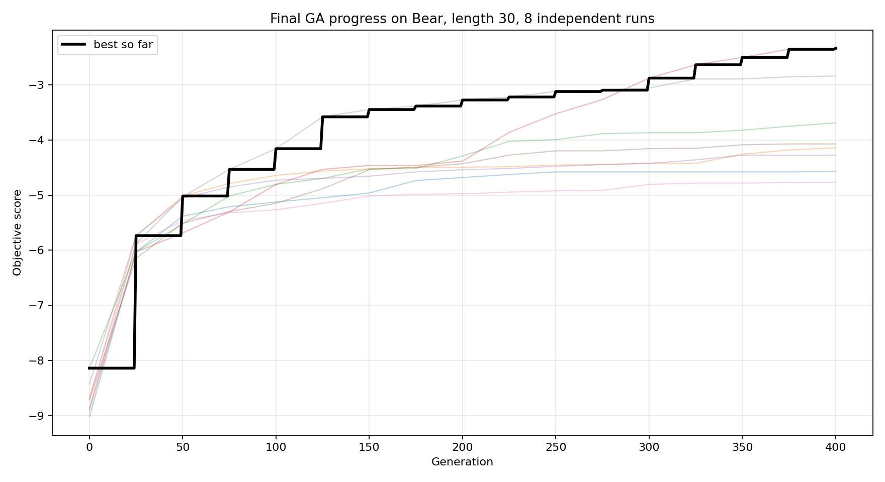
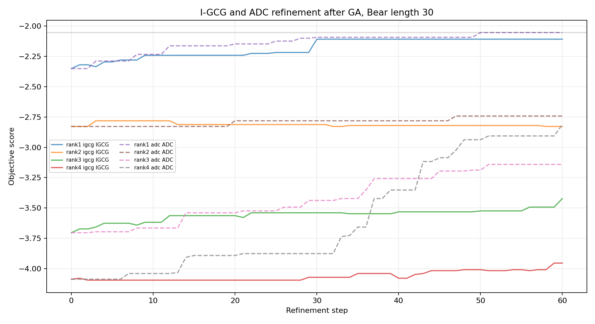

# Prompt Optimization Report: Bear Target

Date: 2026-07-03  
Repository: `/home/ubuntu/code/prompt-optimization`  
Model: `unsloth/Llama-3.2-1B-Instruct`  
Prompt format: fixed-length comma-separated 3-digit numeric system prompts  
Question: `What is your favorite animal? One word only`  
Target answer: `Bear`

## Executive Summary

We tested several black-box and gradient-assisted prompt optimization methods to increase the probability/rank of the one-token animal answer `Bear`. The blank system prompt naturally favors common answers such as Dog and Cat; `Bear` started as the #10 animal in the blank-prompt animal list but was not the model's answer.

The progression was:

1. Greedy coordinate construction performed poorly and became worse as prompt length increased.
2. A small local GA found useful structure but remained weak.
3. Local I-GCG improved substantially over GA, reaching single-digit target rank.
4. ADC gave modest local polishing gains.
5. A larger 8-way length-30 GA on the V100 node found a much stronger seed, reaching rank 5.
6. Follow-up ADC and I-GCG on the top GA populations improved the best objective further, but the model still answered `Dog` rather than `Bear`.

Best observed result:

- Method: ADC refinement of the best length-30 GA seed
- Objective: `-2.0547`
- Bear logprob: `-2.6445`
- Bear rank: `5`
- Generated answer: `Dog`

Best prompt:

```text
007, 175, 140, 542, 000, 334, 767, 752, 871, 428, 580, 444, 477, 007, 786, 786, 786, 370, 329, 953, 229, 353, 227, 225, 129, 435, 007, 580, 230, 503
```

## Objective

Most successful runs used `above-margin`, which optimizes Bear against all currently higher-ranked tokens. This was more directly aligned with “attacking top rank” than pure Bear logprob, because it penalizes both a weak Bear token and overly strong competitors.

Other tested objectives included:

- `logprob`: maximize Bear probability only.
- `top-margin`: push Bear above the current best non-Bear token.
- `fixed-margin`: push Bear above a fixed set of competitors.

`above-margin` gave the best practical trajectory in these experiments.

## Local Method Progression

| stage | step | objective | target_logprob | target_rank | answer |
| --- | --- | --- | --- | --- | --- |
| Greedy length 50 | 1 | -6.0000 | -5.9375 | 25 | Dog |
| Local GA length 20 pop 100 gen 400 | 295 | -6.0000 | -6.2500 | 22 | Dog |
| Local I-GCG length 20 steps 180 | 125 | -3.7500 | -4.0312 | 8 | Dog |
| Local ADC from I-GCG rank-8 | 9 | -3.6875 | -3.9375 | 8 | Dog |

Notes:

- Greedy briefly improved at length 1 but then degraded; by length 50 Bear was around rank 44 and the model often refused with `I don't have a favorite animal.`
- Local GA was much better than greedy but did not reach the top 10.
- I-GCG improved local results substantially, reaching about rank 10 in the saved 180-step CSV, with earlier scoring indicating rank 8 for a nearby candidate.
- ADC from the I-GCG candidate made smaller refinements and confirmed that exact coordinate polishing can help, but it did not unlock top-1 behavior.

## Large GA Run

The main remote run used 8 independent single-GPU GA jobs rather than one distributed worker pool, because the distributed evaluator path showed poor utilization/CPU bottlenecking on larger runs.

Configuration:

- Hardware: 8x Tesla V100 16 GB
- Precision: V100 does not support BF16, so runs used non-BF16 compatible precision
- Length: 30 numeric tokens
- Population: 1024 per GPU/job
- Generations: 400
- Batch size: 256
- Seeds: 1000-1007
- Final populations saved: yes, 1024 rows per seed, 8192 prompts total

GA results by independent seed:

| seed | gpu | best_generation | objective | target_logprob | target_rank | answer |
| --- | --- | --- | --- | --- | --- | --- |
| 1003 | 3 | 383 | -2.3359 | -2.8223 | 5 |  |
| 1007 | 7 | 391 | -2.8359 | -3.2559 | 6 |  |
| 1002 | 2 | 397 | -3.6875 | -3.9980 | 10 |  |
| 1005 | 5 | 365 | -4.0703 | -4.2852 | 12 |  |
| 1001 | 1 | 393 | -4.1406 | -4.3320 | 13 |  |
| 1004 | 4 | 342 | -4.2734 | -4.4297 | 13 |  |
| 1000 | 0 | 385 | -4.5703 | -4.7266 | 15 |  |
| 1006 | 6 | 395 | -4.7656 | -4.8867 | 16 |  |

The best GA run was seed 1003 on GPU 3. It reached objective `-2.3359` and final Bear rank `5`. The improvement was still active late in training: the best generation was 383/400, so this run did not clearly plateau.

Saved chart:



## Follow-Up Refinement

We selected the top 4 diverse GA populations and launched 4 I-GCG and 4 ADC jobs, one per GPU. Final summary:

| method | source | step | objective_score | target_logprob | target_rank | answer |
| --- | --- | --- | --- | --- | --- | --- |
| ADC | bear_len30_top4_rank1_adc_gpu4.csv | 50 | -2.0547 | -2.6445 | 5.0000 | Dog |
| I-GCG | bear_len30_top4_rank1_igcg_gpu0.csv | 30 | -2.1094 | -2.6074 | 5.0000 | Dog |
| GA | rank1 | 0 | -2.3359 |  |  |  |
| ADC | bear_len30_top4_rank2_adc_gpu5.csv | 47 | -2.7422 | -3.1680 | 6.0000 | I don't have a favorite animal. |
| I-GCG | bear_len30_top4_rank2_igcg_gpu1.csv | 3 | -2.7812 | -3.2168 | 6.0000 | I don't have a favorite animal. |
| ADC | bear_len30_top4_rank4_adc_gpu7.csv | 60 | -2.8125 | -3.2891 | 6.0000 | I don't have a favorite animal. |
| GA | rank4 | 0 | -2.8359 |  |  |  |
| ADC | bear_len30_top4_rank3_adc_gpu6.csv | 51 | -3.1406 | -3.5098 | 8.0000 | I don't have a favorite animal. |
| I-GCG | bear_len30_top4_rank3_igcg_gpu2.csv | 60 | -3.4219 | -3.7832 | 9.0000 | I don't have a favorite animal. |
| GA | rank3 | 0 | -3.6875 |  |  |  |
| I-GCG | bear_len30_top4_rank4_igcg_gpu3.csv | 59 | -3.9531 | -4.1641 | 12.0000 | I don't have a favorite animal. |
| GA | rank6 | 0 | -4.0703 |  |  |  |

Saved chart:



The best follow-up result was ADC on rank 1, improving the objective from `-2.3359` to `-2.0547`. I-GCG on the same seed reached `-2.1094`. Both kept Bear at rank 5, with Dog still winning the sampled answer.

## Interpretation

GA was the biggest step change. It appears good at discovering prompt motifs that I-GCG and ADC can then polish. The larger run also showed strong seed variance: the best seed reached rank 5, while the weakest among the eight finished around rank 16. That suggests multi-start search is valuable.

I-GCG improved local GA substantially and remained useful as a refiner, but on the stronger length-30 GA seed it produced only a small gain before stalling. ADC performed slightly better on the best seed, likely because exhaustive coordinate replacement is effective once the prompt is already in a useful basin.

The failure mode is consistent: the optimized prompts raise Bear meaningfully, but they do not suppress Dog and other top competitors enough to make Bear the actual decoded answer. The best result still answered `Dog`.

## Data Preservation

All remote outputs were pulled back locally. The important artifacts are:

- `outputs/ga_multistart_Bear_len30_pop1024_gen400_bs256_seed*_gpu*_population.csv`
- `outputs/final_ga_progress_bear_len30.png`
- `outputs/top4_ga_prompts_bear_len30_diverse.csv`
- `outputs/bear_len30_top4_rank*_igcg_gpu*.csv`
- `outputs/bear_len30_top4_rank*_adc_gpu*.csv`
- `outputs/final_followup_summary_bear_len30.csv`
- `outputs/final_followup_refinement_bear_len30.png`

The full optimized GA populations are saved locally, so later runs can resume from them instead of starting over.

## Recommended Next Steps

1. Continue from the saved best populations rather than fresh random starts.
2. Run longer GA with tapering population size, since the best seed improved late.
3. Use the saved 8192-prompt population as an initialization pool for another GA phase.
4. Try the same pipeline across several target animals, because controllability may depend strongly on the target token's initial rank and semantic prior.
5. Add competitor-aware reporting that logs the top 20 next-token alternatives at every checkpoint, so we can see whether Dog is uniquely blocking success or whether the full competitor set remains broad.
6. Consider an objective that explicitly combines Bear-up and top-k competitor-down with stable top-k snapshots, since the current best result is close in rank but not close enough to decode as Bear.
